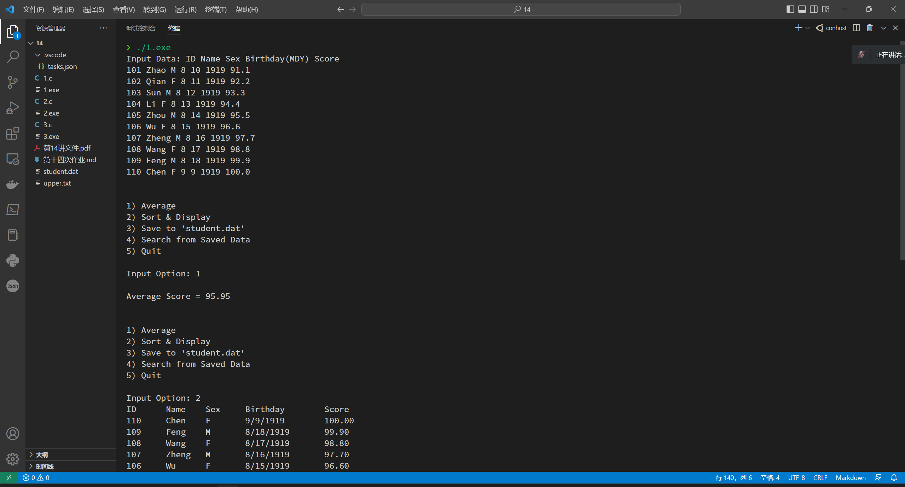
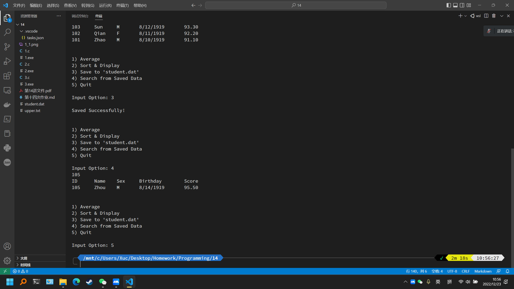
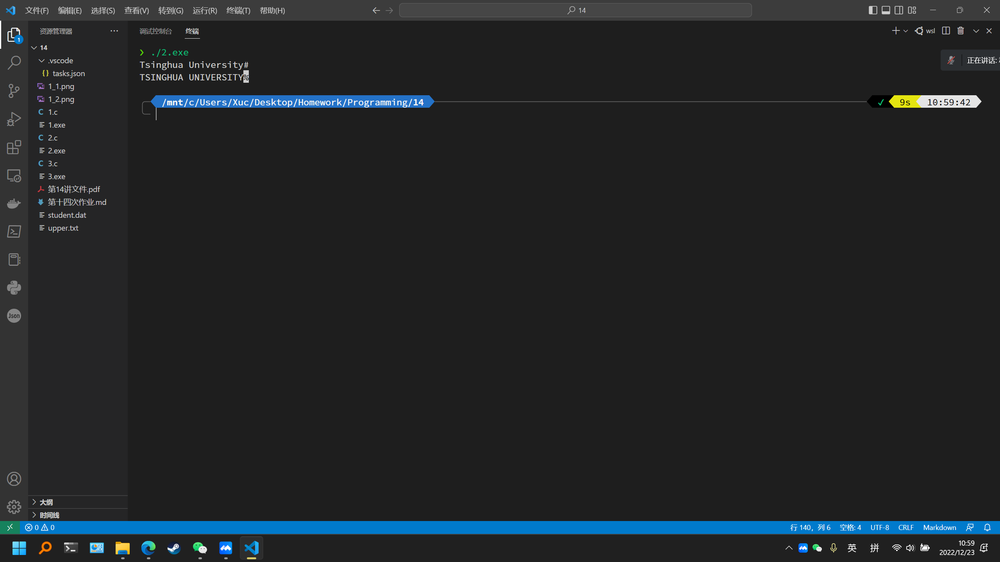
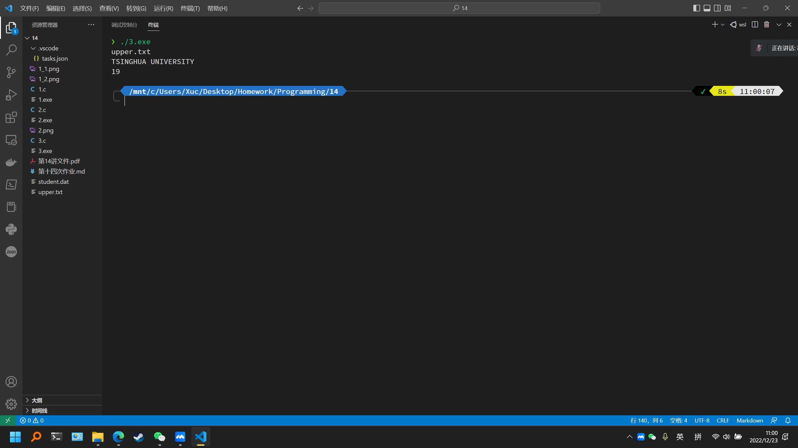

# 第十四次作业

## 实验目的
完成本次作业，巩固上课所学知识

## 实验环境
设备：OMEN by HP Laptop 16-b1xxx
操作系统: Windows 11 专业版 22H2
编辑器: Visual Studio Code 1.72.1
编译器: gcc 12.1.0
终端：Windows Powershell

## 实验内容
### 必做第1题

程序代码

```c
#include <stdio.h>
#include <stdlib.h>
#define N 10
struct student
{
    int ID;
    char name[16];
    char sex;
    struct
    {
        int month;
        int day;
        int year;
    }birthday;
    float score;
};
float average(struct student stu[])
{
    float scoreSum = 0.0, scoreAve = 0.0;
    int i = 0;
    for(i = 0; i < N; i++)
        scoreSum += stu[i].score;
    scoreAve = scoreSum / N;
    return scoreAve;
}
void sortnShow(struct student stu[])
{
    int i = 0, j = 0;
    struct student t, *p;
    for(i = 0; i < N - 1; i++)
        for(j = i + 1; j < N; j++)
            if(stu[i].score < stu[j].score)
            {
                t = stu[i];
                stu[i] = stu[j];
                stu[j] = t;
            }
    printf("ID\tName\tSex\tBirthday\tScore\n");
    for(p = stu; p < stu + N; p++)
        printf("%d\t%s\t%c\t%d/%d/%d\t%.2f\n", p->ID, p->name, p->sex, p->birthday.month, p->birthday.day, p->birthday.year, p->score);
}
void save(struct student stu[])
{
    FILE *fp;
    struct student *p;
    if((fp = fopen("student.dat", "wb")) == NULL)
    {
        printf("Cannot Open File!\n");
        exit(0);
    }
    fwrite(stu, sizeof(struct student), N, fp);
    fclose(fp);
}
void search()
{
    int searchID, flag = 0;
    struct student dat[N], *p;
    FILE *fp;
    if((fp = fopen("student.dat", "rb")) == NULL)
    {
        printf("Cannot Open File.\n");
        exit(0);
    }
    fread(dat, sizeof(struct student), N, fp);
    fclose(fp);
    scanf("%d", &searchID);
    for(p = dat; p < dat + N; p++)
        if(p->ID == searchID)
        {
            printf("ID\tName\tSex\tBirthday\tScore\n");
            printf("%d\t%s\t%c\t%d/%d/%d\t%.2f\n", p->ID, p->name, p->sex, p->birthday.month, p->birthday.day, p->birthday.year, p->score);
            flag = 1;
            break;
        }
    if(!flag) printf("No Result.\n");
}
void interface(struct student stu[])
{
    int opt = 0;
    do
    {
        printf("\n\n");
        printf("1) Average\n");
        printf("2) Sort & Display\n");
        printf("3) Save to 'student.dat'\n");
        printf("4) Search from Saved Data\n");
        printf("5) Quit\n");
        printf("\nInput Option: ");
        scanf("%d", &opt);
        switch(opt)
        {
            case 1: printf("\nAverage Score = %.2f\n", average(stu)); break;
            case 2: sortnShow(stu); break;
            case 3: save(stu); printf("\nSaved Successfully!\n"); break;
            case 4: search(stu); break;
            case 5: break;
            default: printf("\nPlease Input a Valid Value.\n"); break;
        }
    }
    while(opt != 5);
}
int main()
{
    struct student stu[N];
    int i = 0;
    printf("Input Data: ID Name Sex Birthday(MDY) Score\n");
    for(i = 0; i < N; i++)
    {
        scanf("%d", &stu[i].ID);
        scanf("%s", stu[i].name);
        getchar();
        scanf("%c", &stu[i].sex);
        scanf("%d", &stu[i].birthday.month);
        scanf("%d", &stu[i].birthday.day);
        scanf("%d", &stu[i].birthday.year);
        scanf("%f", &stu[i].score);
    }
    interface(stu);
    return 0;
}
```

运行结果



### 必做第2题

程序代码

```c
#include <stdio.h>
#include <stdlib.h>
int main()
{
    FILE *fp;
    char ch = 0;
    if((fp = fopen("upper.txt", "wt")) == NULL)
    {
        printf("Cannot Open File!\n");
        exit(0);
    }
    while((ch = getchar()) != '#')
    {
        if(ch >= 'a' && ch <= 'z') ch -= 32;
        fputc(ch, fp);
    }
    fclose(fp);
    if((fp = fopen("upper.txt", "rt")) == NULL)
    {
        printf("Cannot Open File!\n");
        exit(0);
    }
    while((ch = fgetc(fp)) != EOF) putchar(ch);
    fclose(fp);
    return 0;
}
```

运行结果


### 必做第3题

程序代码

```c
#include <stdio.h>
#include <stdlib.h>
#include <string.h>
int main()
{
    FILE *fp;
    char fName[81] = {0}, str[81] = {0};
    scanf("%s", fName);
    if((fp = fopen(fName, "rt")) == NULL)
    {
        printf("Cannot Open File!\n");
        exit(0);
    }
    fgets(str, 80, fp);
    printf("%s\n", str);
    printf("%d\n", strlen(str));
    fclose(fp);
    return 0;
}
```

运行结果


## 实验体会
需要认真学习，仔细完成作业。
