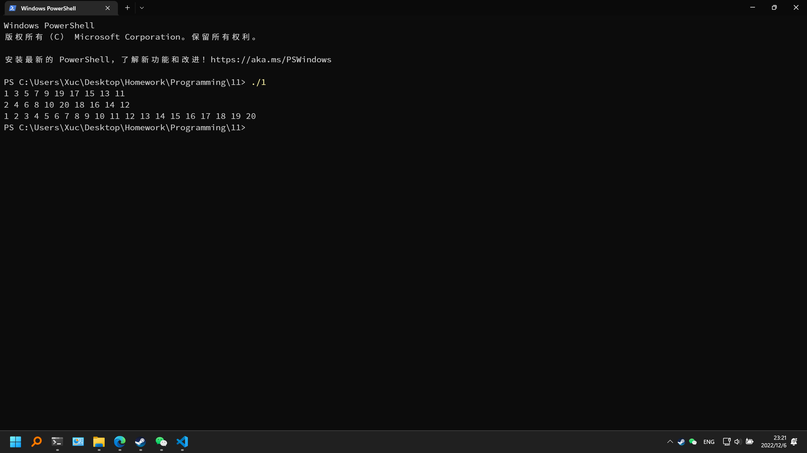
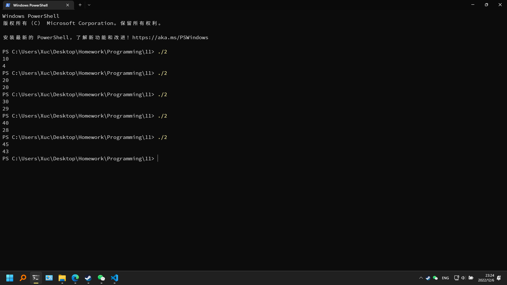
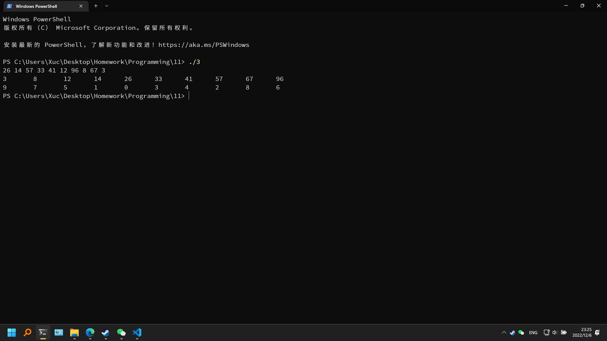
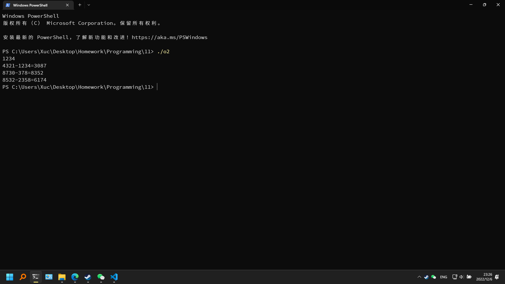

# 第十一次作业

## 实验目的
完成本次作业，巩固上课所学知识

## 实验环境
设备：OMEN by HP Laptop 16-b1xxx
操作系统: Windows 11 专业版 22H2
编辑器: Visual Studio Code 1.72.1
编译器: gcc 12.1.0
终端：Windows Powershell

## 实验内容
### 必做第1题

程序代码
```c
#include <stdio.h>
void sort(int ar[], int n)
{
    int i, j, t;
    for(i = 0; i < n - 1; i++)
        for(j = 0; j < n - 1 - i; j++)
            if(*(ar + j) > *(ar + j + 1))
            {
                t = *(ar + j);
                *(ar + j) = *(ar + j + 1);
                *(ar + j + 1) = t;
            }
}
int main()
{
    int a[10] = {0}, b[10] = {0}, c[20] = {0};
    int i;
    int *p = a, *q = b, *r = c;
    for(i = 0; i < 10; i++)
        scanf("%d", a + i);
    for(i = 0; i < 10; i++)
        scanf("%d", b + i);
    sort(a, 10); sort(b, 10);
    while((p - a) < 10 || (q - b) < 10)
    {
        if((p - a) == 10)
        {
            *r = *q;
            q++; r++;
        }
        else if((q - b) == 10)
        {
            *r = *p;
            p++; r++;
        }
        else if(*p < *q)
        {
            *r = *p;
            p++; r++;
        }
        else
        {
            *r = *q;
            q++; r++;
        }
    }
    for(i = 0; i < 20; i++)
        printf("%d ", *(c + i));
    return 0;
}
```

运行结果



### 必做第2题

程序代码
```c
#include <stdio.h>
void del(int *p, int m);
int main()
{
    int num[50] = {0};      //设置一个保存每人编号数组num[50]
    int n;
    scanf("%d", &n);        //输入n的值
    del(num, n);
    return 0;
}
void del(int *p, int m)
{
    int cnt = 0, sum = m;
    int *q;
    q = p;
    while(sum > 1)
    {
        if(!(*q)) cnt++;
        if(cnt == 3) {*q = 1; sum--; cnt = 0;}
        q++;
        if(q - p >= m) q -= m;
    }
    for(q = p; q - p < m; q++)
        if(!(*q))
        {
            printf("%d\n", (q - p) + 1);
            break;
        }
}

```

运行结果


### 必做第3题

程序代码
```c
#include <stdio.h>
void sort(int *ar[], int n)
{
    int i, j;
    int *t;
    for(i = 0; i < n - 1; i++)
        for(j = 0; j < n - 1 - i; j++)
            if(**(ar + j) > **(ar + j + 1))
            {
                t = *(ar + j);
                *(ar + j) = *(ar + j + 1);
                *(ar + j + 1) = t;
            }
}
int main()
{
    int a[10] = {0};
    int *pa[10] = {0};
    int i;
    for(i = 0; i < 10; i++)
        pa[i] = &a[i];
    for(i = 0; i < 10; i++)
        scanf("%d", a + i);
    sort(pa, 10);
    for(i = 0; i < 10; i++)
        printf("%d\t", **(pa + i));
    printf("\n");
    for(i = 0; i < 10; i++)
        printf("%d\t", *(pa + i) - a);
    return 0;
}
```

运行结果


### 选做第1题

运行结果
```powershell
HhnewyearNEWYEAR
YEAR
```

### 选做第2题

程序代码
```c
#include <stdio.h>
void sort(int a[])
{
    int i, j, t;
    for(i = 0; i < 3; i++)
        for(j = 0; j < 3 - i; j++)
            if(a[j] > a[j + 1])
            {
                t = a[j];
                a[j] = a[j + 1];
                a[j + 1] = t;
            }
}
void kablek(int *a)
{
    int max, min, output, i;
    sort(a);
    max = a[3] * 1000 + a[2] * 100 + a[1] * 10 + a[0];
    min = a[0] * 1000 + a[1] * 100 + a[2] * 10 + a[3];
    output = max - min;
    printf("%d-%d=%d\n", max, min, output);
    if(output != 6174)
    {
        for(i = 0; i < 4; i++)
        {
            a[i] = output % 10;
            output /= 10;
        }
        kablek(a);
    }
}
int main()
{
    int n = 0;
    int a[4] = {0};
    int i;
    scanf("%d", &n);
    if(n >= 1000 && n <= 9999)
    {
        for(i = 0; i < 4; i++)
        {
            a[i] = n % 10;
            n /= 10;
        }
        kablek(a);
    }
    else printf("error\n");
    return 0;
}
```

运行结果


## 实验体会
需要认真学习，仔细完成作业。